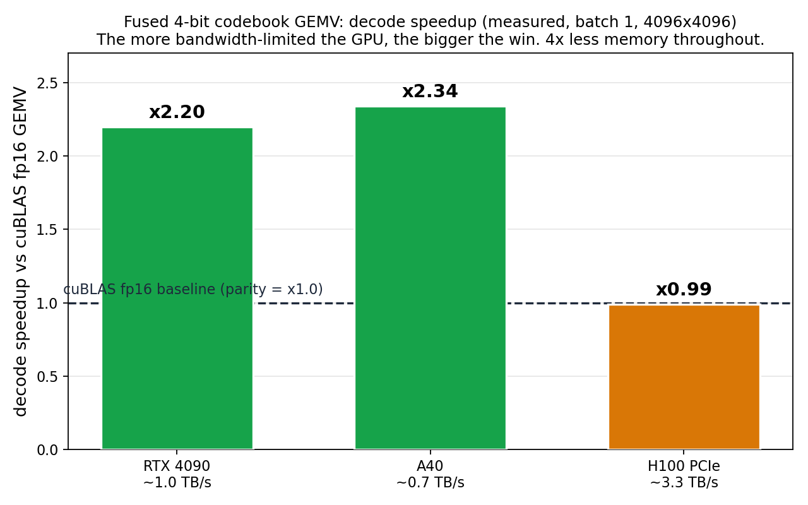

# cuda-codebook

Fused CUDA kernels for **codebook (non-uniform / k-means) weight quantization** of
LLM linear layers. The "index to weight" lookup is folded into the matmul, so the
dequantized weight matrix `W` is never materialized in global memory.

```
W_deq[i, j] = codebook[ indices[i, j], j ]            # per-output-channel codebooks
Y[m, j]     = sum_i  X[m, i] * W_deq[i, j]
```

- `indices` : `[IC, OC]`, one cluster id per weight (`uint8`, or packed `4-bit`)
- `codebook`: `[K, OC]`, `fp16` (small per-column table, `K` in 16..256)
- `X`       : activations `fp16`; `Y`: output `fp16`

## Scope (read this first)

This repository is a **kernel-level study**, not a quantization *method* paper.

- It measures **throughput / latency** of fused dequant + GEMV/GEMM kernels versus
  cuBLAS fp16, on **synthetic** matrices with **random** codebooks and indices.
- It now also takes the scheme to a real model end to end (Llama-2 7B, see
  *Model-level results* below): the kernel is wired into PyTorch and the scheme's
  accuracy and memory are measured. The scheme implemented here (scalar
  per-output-channel codebooks) is the SqueezeLLM family; on *accuracy* at low bits
  it is behind vector/lattice/trellis methods (AQLM, QuIP#, QTIP), which we confirm
  directly below.
- Kernel correctness means **numerical agreement with a cuBLAS reference** on the
  same random data (max relative error reported), separate from model accuracy.

The contribution is the fused-decode **kernel** (and now its end-to-end memory /
speed on a real model); the value is memory and decode speed, not accuracy.

## Why fuse

Storing each weight as a small cluster index shrinks the layer 2x (uint8) to 4x
(4-bit). Dequantizing in a separate pass (write `W`, then GEMM) wastes the
bandwidth the quantization just saved. These kernels fold the lookup into the
matmul so the dequantization adds no extra global traffic.

## Benchmarks

Unless a row says otherwise, reference numbers below were measured on a single
**NVIDIA A40** (`sm_86`, CUDA 11.8) with matrices `IC = OC = 4096`, fp16
activations/output (the cross-GPU section adds RTX 4090 and H100). Every kernel is
checked for numerical correctness against cuBLAS on the same data.

**Reproducibility.** All randomness is generated by `std::mt19937(0)` in the CUDA
sources (fixed **seed = 0**). Timings use `cudaEvent` over 50..500 iterations after
a warm-up. Regenerate the full table on your own GPU with `python benchmark.py`
(auto-detects arch; writes `results.json` + `results.md` with the GPU, driver and
CUDA version captured).

### Decode regime (GEMV, batch M = 1, memory-bound)

| Kernel | scheme | latency | vs cuBLAS | max rel. err |
|---|---|---:|---:|---:|
| cuBLAS fp16 dense (baseline) | dense fp16 | 0.0612 ms | 1.00x | - |
| `gemv_codebook.cu` | uint8, K = 256 | 0.0562 ms | 1.09x | 2.9e-5 |
| `gemv_codebook.cu` | uint8, K = 64 | 0.0389 ms | 1.57x | 2.4e-5 |
| `gemv_codebook_4bit.cu` | 4-bit, K = 16 | 0.0261 ms | **2.34x** | 2.6e-5 |

Decode is memory-bound, so reading fewer weight bytes directly buys latency. The
dominant cost is streaming the index matrix; the lever is bits per index.

### Cross-GPU decode: the bandwidth law (4-bit, K = 16)

The 4-bit fused GEMV (`gemv_codebook_hopper_v2.cu`) was re-measured against a *live*
cuBLAS fp16 GEMV on three GPUs (same `4096x4096`, batch 1, seed 0, rel. err ~3e-4):



| GPU | bandwidth class | speedup vs cuBLAS fp16 |
|---|---|---:|
| RTX 4090 (`sm_89`) | ~1.0 TB/s | **x2.20** |
| A40 (`sm_86`) | ~0.7 TB/s | **x2.34** |
| H100 PCIe (`sm_90`) | ~3.3 TB/s | x0.99 (tie) |

**The more bandwidth-limited the GPU, the bigger the win**, because the kernel reads
1/4 the weight bytes. On consumer / bandwidth-bound GPUs that is a ~2.2-2.3x decode
speedup for 4x less memory. On a bandwidth-rich H100, fp16 GEMV is already
near-roofline, so the kernel only ties cuBLAS and the gain there is memory, not speed.

A recorded **negative result**: a Hopper variant that staged the codebook in
thread-block-cluster distributed shared memory (`gemv_codebook_hopper.cu`) came out
~100x slower. A small codebook wants *local* shared-memory reads in the hot loop, not
remote DSMEM. Kept in the repo as a documented dead end, alongside an L2-codebook /
X-staging sweep (`gemv_codebook_hopper_v3.cu`) where every variant regressed.

### PyTorch binding and per-layer speedup

`quant_demo.py` wraps the kernel as a torch custom op (`codebook_gemv`) plus a
per-column k-means quantize recipe, verified end to end on a real weight (rel. err
2.3e-7 vs the reconstruction). The decode speedup vs a torch dense fp16 mat-vec
(`torch.mv`, the batch-1 path a real fp16 `Linear` runs) grows with layer size,
measured on an RTX 4090:

| layer (IC x OC) | speedup vs torch dense fp16 |
|---|---:|
| 3072 x 768 (small)        | x0.58 (loses, overhead bound) |
| 4096 x 4096               | x2.10 |
| 11008 x 4096 (MLP down)   | x3.70 |
| 4096 x 11008 (MLP up)     | x3.77 |

Tiny matrices are overhead bound and lose; the large MLP layers that dominate an
LLM parameter count win x3.7. Apply the kernel selectively to the large layers.
Reproduce with `python shapes_test.py`.

### Model-level results (Llama-2 7B)

The scheme was taken all the way to a real model (scripts in the companion
[`llm-quant-bench`](https://github.com/Tomahawk888/llm-quant-bench) repo; full
write-up in `paper/main.pdf`).

**Memory.** Quantizing all 224 projection layers to 4-bit drops peak VRAM from
13.56 GB to 4.63 GB (**2.9x**); the 7B model runs in under 5 GB on a consumer card.

**Decode speed vs the real cuBLAS path.** Against `F.linear` (cuBLAS GEMV, not the
weak `torch.mv`), the kernel runs the 224-GEMV decode work of one token at **172
tok/s versus 70 (x2.4)**, both CUDA-graph captured, so the kernel genuinely beats
cuBLAS at batch 1. A naive per-layer custom-op swap loses end to end (x0.73) only
because of per-op `float32->float16` casts in the wrapper, not the kernel. Building
the clean integration (kernel writes fp16 into preallocated buffers, decode step
captured as one CUDA graph over a static-cache loop) **realizes the win: the codebook
model decodes 123.4 vs 61.6 tok/s vs fp16 (x2.0 end-to-end) at 4.73 vs 13.58 GB.** The
arc is x0.73 (naive) -> x0.85 (cast-free eager) -> **x2.0 (CUDA-graphed)**. The win
grows with size and bandwidth-boundedness: Llama-2 13B on an A40 decodes 49.0 vs 20.0
tok/s (**x2.46**) at 8.50 vs 26.17 GB (3.08x less).

**Accuracy, and its ceiling.** wikitext-2 PPL goes 5.83 (fp16) -> 6.34 (4-bit
codebook). Three attempts to close the gap to AWQ all fail: a simple activation-aware
calibration reaches 6.17, the full AWQ pipeline (output-error scale search + weight
clipping) does not improve on it (6.21), a naive vector quantizer is catastrophic
(diverges, with or without per-channel normalization), and incoherence processing (a
random orthogonal rotation before quantizing, the QuIP# lever) moves it only marginally
(6.34 -> 6.29). AWQ's scaling assumes a uniform grid while a codebook is already
adaptive; real vector/trellis accuracy needs AQLM/QuIP#-level machinery (residual
codebooks, incoherence paired with vector quantization, fine-tuning). **The value
of this scheme is memory and kernel speed, not accuracy.**

### Toward vector codebooks: a fused additive-VQ decode kernel (preliminary)

The scalar codebook's accuracy ceiling is structural (above). The accuracy frontier is
*vector* quantization (AQLM, QuIP#): a group of `D` weights is reconstructed as a SUM of
`M` codebook vectors, `w_group = sum_m C_m[code_m]`, which reaches near-fp16 quality at
2 bits. Their kernels are the bottleneck. `avq_gemv.cu` is a first fused decode kernel
for exactly this scheme. The trick: in `y[o] = sum_g <x_g, w_group>`, the dot
`<x_g, C_m[k]>` is independent of the output, so a per-group LUT `LUT[m][k] = <x_g,
C_m[k]>` is built once in shared memory, then `y[o] = sum_g sum_m LUT[m][code_m[o,g]]`.
The kernel reads the **codes**, never the dense weight: at 2 bits (M=2, K=256, D=8) that
is 4.2 MB of codes vs 33.6 MB of fp16 weight.

Measured at `4096x4096`, batch 1, vs a live cuBLAS fp16 GEMV (rel. err 2.3e-4, all
verified):

| GPU | additive-VQ 2-bit vs cuBLAS fp16 |
|---|---:|
| RTX 4090 (~1.0 TB/s) | x1.71 |
| A40 (~0.7 TB/s) | **x4.30** |

So a fused **2-bit** decode kernel beats cuBLAS by up to **4.3x**, more so on
bandwidth-bound GPUs (the same bandwidth law), at a bit rate where accuracy is near
fp16. This is the combination the scalar scheme could not reach (accuracy *and* speed).

Tuning trail (`avq_gemv.cu` v1 -> `avq_gemv2.cu` -> `avq_gemv3.cu`): the first cut sat
at ~22% of the memory roofline. Reducing syncs (v2, group-tile LUT) did *not* help, the
bottleneck was the 1-byte code reads, not synchronization. Reading 4 codes per thread as
one **uint32** (v3) lifted the A40 from x2.35 to **x4.30** (153 -> 277 GB/s effective,
~40% roofline). Optimal group tile GT=16 (GT>=20 overflows static shared memory and
silently fails to launch, an easy trap). Still uses random codebooks (no real AQLM
codebooks / model yet); wiring those in and closing the remaining roofline gap is the
path to a Pareto-dominant result (2-bit, near-fp16 accuracy, faster decode, less memory).
Reproduce with `nvcc -O3 -arch=sm_86 -DGT=16 avq_gemv3.cu -lcublas -o avq3 && ./avq3`.

**Real AQLM codebooks (validated).** This kernel's scheme is exactly AQLM's `2x8`
format. Loading the real `ISTA-DASLab/Llama-2-7b-AQLM-2Bit-2x8-hf` checkpoint, its
`codebooks` are `[2, 256, 1, 8]` (M=2, K=256, group 8), `codes` `[4096, 512, 2]`, with a
per-output `scales` `[4096]`, all mapping one-to-one onto this kernel (add the per-output
scale at the end). So the kernel decodes **real AQLM weights**, not just random data. The
honest tension: that 2x8 config (the one a shared-memory LUT can decode) gives PPL 7.63
on Llama-2 7B, worse than scalar 4-bit (6.34) though at *half* the bits, and far better
than scalar *2-bit* which diverges. The accuracy-competitive AQLM is `1x16`
(K = 65536), whose 256 KB-per-group LUT does not fit shared memory and needs a different,
slower kernel (which is why AQLM decode is slow). We tested the `4x8` path (M=4, 4 bits). The kernel stays fast (M=4 decodes at **x2.39**
on the A40, GT=4, verified). On accuracy, a *greedy* additive fit only ties the scalar
4-bit codebook (PPL 6.32 vs 6.34): the additive *structure* alone does not beat scalar,
AQLM's edge is its *training*. So we reproduced the core of that training (per-output
scale + **beam-search** code assignment + **least-squares** codebook updates, alternating;
no block fine-tuning), in `llama_aqlm_train.py`. That **wins**: at M=4 it reaches PPL
**6.13, beating the scalar 4-bit codebook (6.34)** at equal bits, while the kernel still
decodes it at **x2.39** on the A40. And that is one alternating round with no calibration
or block fine-tuning, the levers the full AQLM pipeline adds to push further toward fp16
(5.83). So the Pareto point holds: trained additive VQ is **more accurate than the scalar
codebook at the same bits and the same decode speed**, and this kernel is the fast-decode
path that makes it usable (it also makes 2-bit *usable* and fast, x4.27, where the scalar
2-bit codebook diverges).

### Standalone dequantization (bandwidth)

| Kernel | effective bandwidth |
|---|---:|
| naive (redundant shared-memory staging) | 31.8 GB/s |
| `dequant_l2` (L2-cached gather) | **213 GB/s** (6.7x) |

### Prefill regime (GEMM, M = 2048, compute-bound)

| Kernel | TFLOP/s | vs cuBLAS | rel. err |
|---|---:|---:|---:|
| naive wmma (1 warp / tile) | 2.3 | 0.02x | 2.6e-4 |
| tiled fused | 9.5 | 0.09x | 2.6e-4 |
| cp.async double-buffering, 128x128 tiles | 12.3 | 0.12x | 2.6e-4 |
| + register-pipelined dequant (`prof10.cu`) | **22.4** | 0.21x | 2.6e-4 |
| raw `mma.sync` m16n8k16 (`prof11.cu`) | 22.0 | 0.21x | 2.6e-4 |
| cuBLAS fp16 (baseline) | ~105 | 1.00x | - |

Prefill is compute-bound: cuBLAS already runs near the Tensor-Core peak, so a
fused-dequant kernel can at best *match* it. Here the best fused kernel reaches
~10x the naive baseline but ~0.21x of cuBLAS; **in the prefill regime, codebook
quantization buys memory, not speed.** Closing the remaining gap requires
`ldmatrix` + shared-memory swizzling (production-Marlin engineering); a separate
experiment (`prof11.cu`) shows the wmma API is *not* the bottleneck (raw
`mma.sync` matches it), so the remaining gap is occupancy + bank conflicts.

## Reproducing

```bash
# one kernel
nvcc -O3 -arch=sm_90 gemv_codebook_4bit.cu -o gemv4 && ./gemv4   # adjust -arch

# full reference table on your GPU (writes results.json + results.md)
python benchmark.py --arch sm_90
```

`-arch`: `sm_80` (A100), `sm_86` (A40/A10/RTX30), `sm_89` (L4/RTX40), `sm_90`
(H100/H200). The `mma.sync` and `cp.async` paths require `sm_80+`.

## Where this sits in the literature (honest positioning)

This work is **not directly comparable** to accuracy-focused quantization methods,
because it reports kernel throughput rather than model accuracy. For context, here
is what those methods actually optimize:

| Method | Quantizes | Bit regime | Core idea | Evaluated on | Ships kernels |
|---|---|---|---|---|---|
| GPTQ | weights | 3-4b | Hessian error compensation | accuracy (PPL) | via others |
| AWQ | weights | 4b (W4A16) | activation-aware scaling | accuracy | yes |
| SqueezeLLM | weights | 3-4b | **k-means non-uniform** + dense&sparse | accuracy | LUT |
| QuIP# | weights | 2b | incoherence (Hadamard) + E8 lattice VQ | accuracy | yes |
| QTIP | weights | 2-3b | trellis-coded quant + incoherence | accuracy (SOTA low-bit) | yes |
| AQLM | weights | 2-3b | additive vector quantization | accuracy | yes |
| QuaRot | W+A+KV | 4b (W4A4) | Hadamard rotations remove outliers | accuracy | yes |
| SpinQuant | W+A | 4b | learned rotations | accuracy | yes |
| Atom | W+A+KV | 4b (W4A4) | mixed-precision outliers + group quant | accuracy | yes |
| **this repo** | weights | uint8 / 4b | **scalar codebook, fused decode kernel** | **kernel throughput vs cuBLAS** | this is the kernel |

The scheme implemented here is closest to **SqueezeLLM** (scalar k-means), which is
not the accuracy frontier (QTIP/AQLM/QuIP# are). The relevant *peers for this work*
are kernel/systems papers, not the accuracy methods above:

- **Marlin** / **Machete** (W4A16 mixed-precision GEMM, Ampere/Hopper)
- **FLUTE** (flexible lookup-table GEMM for non-uniform quant)
- **VQ-LLM** (efficient vector-quantization inference kernels)
- the decode kernels shipped with QuIP#, QTIP, AQLM

A fair *speed* comparison would benchmark this kernel against those at matched
accuracy on a real model. That is not done here: the only baseline used is
cuBLAS fp16 dense (an upper bound on dense throughput) on synthetic data.

## Limitations

- **Accuracy ceiling.** Llama-2 7B is now quantized end to end (PPL 5.83 -> 6.34 at
  4-bit, memory 2.9x), but the scalar codebook trails activation-aware and vector
  methods, and three calibration / VQ attempts to close the gap fail (see *Model-level
  results*). Zero-shot `lm-eval-harness` is still not run.
- **Synthetic data.** Codebooks and indices are random (`mt19937(0)`). Real
  weight/index distributions (and their effect on cache behaviour and bank
  conflicts) may differ.
- **Scalar codebook only.** Per-output-channel scalar k-means. No vector/lattice/
  trellis quantization, no incoherence/rotation preprocessing, no activation or KV
  quantization. On low-bit accuracy this scheme is behind the current frontier.
- **Single GPU, single shape.** Measured on one A40 at `4096x4096`. Numbers will
  differ on H100/H200 and at other shapes; re-run `benchmark.py`.
- **Prefill is not at cuBLAS parity.** The Tensor-Core path reaches ~0.21x of
  cuBLAS. It is correct and ~10x over the naive baseline, but not competitive with
  a tuned dense GEMM in the compute-bound regime.
- **No comparison against the real kernel peers** (Marlin/FLUTE/VQ-LLM/Machete);
  only cuBLAS. So "faster than cuBLAS in decode" is an absolute statement about a
  memory-bound microbenchmark, not a claim of being the fastest quantized kernel.
- **Codebook quantization is not novel.** The contribution here is the fused-decode
  kernel engineering, not the quantization idea.

## Roadmap to a model-level result

To turn this into a defensible research comparison:

1. Quantize a real model with this codebook scheme; report wikitext PPL and
   `lm-eval-harness` zero-shot, at matched effective bits. *Partly done:* Llama-2 7B
   is quantized to 4-bit (PPL 5.83 -> 6.34, memory 2.9x); calibration and VQ attempts
   to lift accuracy are documented negative results. `lm-eval-harness` still pending.
2. Benchmark decode/prefill against Marlin, FLUTE, VQ-LLM and the QuIP#/QTIP
   kernels **at matched accuracy** (the only fair speed axis).
3. Port the kernels to Hopper. *Partly done:* the 4-bit decode kernel now compiles
   and is measured on `sm_89`/`sm_90` (see the cross-GPU table). The cluster +
   distributed-shared-memory route was tried and lost (~100x slower). What remains is
   TMA-based streaming, FP8 Tensor Cores, and an `mma`/`wgmma` prefill path; on H100
   the decode kernel currently only ties cuBLAS, so closing that needs an atomic-free
   reduction, not the tweaks already swept.

## File guide

- `gemv_codebook_4bit.cu` - decode GEMV, 4-bit packed indices (K <= 16). Fastest scalar.
- `avq_gemv.cu` / `avq_gemv2.cu` / `avq_gemv3.cu` - fused additive vector-quantization
  (AQLM-style) decode GEMV, LUT-based, 2-bit. v1 (split-K) -> v2 (group-tile LUT, sync
  reduction, no help) -> v3 (vectorized uint32 code reads, **x4.30 on A40**). The
  accuracy-frontier + speed direction (preliminary, random codebooks).
- `gemv_codebook_hopper_v2.cu` - the 4-bit decode GEMV with a live cuBLAS baseline,
  built per-arch (`sm_89`/`sm_90`/...); prints the device name + speedup. Source of
  the cross-GPU table above.
- `gemv_codebook_hopper.cu` - cluster + distributed-shared-memory variant (negative
  result, ~100x slower; documented dead end).
- `gemv_codebook_hopper_v3.cu` - H100 tuning sweep (L2 codebook / X-staging); all
  knobs regress vs v2.
- `plot_speedup.py` - renders `gpu_speedup.png` from the measured per-GPU numbers.
- `quant_demo.py` - PyTorch custom op (`codebook_gemv`) + per-column quantize recipe,
  verified end to end on a real GPT-2 weight.
- `shapes_test.py` - speedup of the torch op vs dense fp16 across layer shapes.
- `gemv_codebook_v2decode.cu` - atomic-free two-pass decode experiment (recorded
  negative result: even with the atomic version, the atomic was not the bottleneck).
- `gemv_codebook.cu` - decode GEMV, uint8 indices (K <= 256).
- `codebook_quant.cu` - reference on-the-fly dequant kernel + first fused GEMV.
- `bench.cu` - decode + dequant benchmark harness vs cuBLAS.
- `prof2.cu` .. `prof11.cu` - the measured optimization trail (ablation, vectorized
  indices, split-K, 4-bit packing, Tensor-Core prefill, cp.async, raw `mma.sync`).
- `benchmark.py` - reproducible build/run/parse harness (writes `results.json`).

## License & citation

Licensed under **CC BY 4.0** (see `LICENSE`): you may use, share and adapt the
material, including commercially, **with attribution**. If you use this work,
please cite it via `CITATION.cff`.

Note: CC licenses are intended for creative works rather than software; for a pure
software project, Apache-2.0 or MIT is the more conventional choice.
