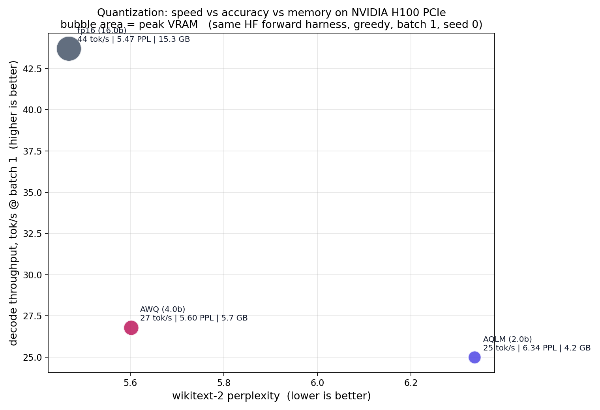

# Quantization benchmark and model-level experiments

Part of [trapetum](../). Benchmark scripts live here in `bench/`; the model-level
codebook scripts referenced below live in [`../model/`](../model/).

A fair, reproducible **speed vs accuracy vs memory** benchmark of LLM
weight-quantization methods (fp16, AWQ, AQLM, and a wired-up but not-yet-working
GPTQ / QTIP), measured on a single GPU under one harness.

This is a baseline-establishing measurement ("what does low-bit quantization
actually cost in decode speed, and what does it buy in memory?"), not a new
quantization method. All numbers below were measured on an **NVIDIA H100 PCIe**,
HuggingFace forward path, greedy, batch 1, seed 0, **full wikitext-2 perplexity**.

## Results

### Llama-2-7B (small model, big GPU)



| method | decode | VRAM | wikitext-2 PPL |
|---|---:|---:|---:|
| fp16 | 43.7 tok/s | 15.3 GB | 5.47 |
| AWQ 4-bit | 26.8 tok/s | 5.7 GB | 5.60 |
| AQLM 2-bit | 25.0 tok/s | 4.2 GB | 6.34 |

Notes on the numbers above (labeled so cross-doc figures do not read as contradictions):

- **fp16 = 5.47 PPL** here is the HuggingFace forward path (seqlen 2048, median of 3),
  the single-harness bench value that matches the published Llama-2-7B PPL. The main
  codebook README quotes **5.83** fp16 from a *different* eval harness (the custom
  codebook evaluation used for the ablations), so 5.47 vs 5.83 is two harnesses, not a
  contradiction.
- **AQLM 2-bit = 6.34 PPL** here is the AQLM **1x16** checkpoint (K = 65536). The
  codebook README loads the AQLM **2x8** checkpoint (PPL **7.63**) because 2x8 is the
  config a shared-memory LUT can decode; these are *different* AQLM checkpoints, so the
  6.34-vs-7.63 gap is expected, not a contradiction.

At 7B on an H100, every quantized method is **slower** than fp16 at single-stream
decode. Quantization here buys memory (15 GB to 4-6 GB), not latency: on a GPU with
this much bandwidth, fp16 decode is already fast and the dequant overhead dominates
at batch 1.

### Llama-2-70B (model too big for fp16 on one GPU)


| method | decode | VRAM | wikitext-2 PPL |
|---|---:|---:|---:|
| fp16 | does not fit | ~138 GB (2+ GPUs) | n/a |
| AWQ 4-bit | 9.1 tok/s | 38 GB | 3.41 |
| AQLM 2-bit | 9.2 tok/s | 21 GB | 4.06 |

The story flips: fp16 70B needs ~138 GB (2+ GPUs). Quantized, it fits on **one**
80 GB H100, and AQLM 2-bit (21 GB) fits a single **RTX 4090**. Here quantization is
not a speed tax, it is what makes the model runnable at all.

Bonus: AQLM 2-bit 70B (PPL 4.06 @ 21 GB) is far more accurate than fp16 7B
(PPL 5.47 @ 15 GB). For a similar memory budget, a 2-bit 70B beats an fp16 7B.

**Sanity check:** fp16 7B = 5.47 PPL matches the published Llama-2-7B value;
AWQ 70B = 3.41 matches published. The numbers line up with the literature.

## Methodology (so it is not debunkable)

- Every method is loaded through the **same HuggingFace forward path** and timed by
  the **same loop**: this isolates the quantization kernel's cost, not a serving
  engine. A vLLM / TensorRT-LLM serving comparison is a separate study.
- Greedy decoding, fixed seq lengths, **fixed seed 0**, warmup + median of 3.
- Each method uses its own intended kernel (AQLM, AWQ); none is crippled. Library
  versions are captured in the JSON, so the kernel is identifiable.

## Honest limits

- **GPTQ and QTIP are not in the results.** `gptqmodel` would not build on the test
  pod (3 attempts), and QTIP (Cornell-RelaxML/qtip) is a custom research repo that
  needs manual wiring; the loader hook is present but the checkpoint id / install
  must be completed. AWQ represents the 4-bit point and AQLM the 2-bit point. The
  skips are recorded in `results.json`.
- HF forward harness (not a tuned serving engine); 7B on an H100 is the regime where
  dequant overhead is most visible. Different GPUs / batch sizes shift the picture.

## Run

```bash
bash setup.sh          # torch 2.4.0+cu121 + transformers 4.44.2 + aqlm/awq, pinned
huggingface-cli login  # only if you swap in gated checkpoints
python bench_quant.py --only fp16,aqlm-2bit,awq-4bit --out results.json
python plot_pareto.py results.json --out pareto.png
python plot_mem70.py   # 70B memory bar (uses results_70b.json)
```

`setup.sh` encodes the dependency recipe that actually works (the trap: RunPod
images ship an old torch / CUDA 11.8 while modern quant libs need torch 2.4 / CUDA
12; pin torch so nothing silently upgrades it).

## Codebook scheme on a real model

This repo also hosts the model-level experiments for the fused codebook kernel from
[`trapetum`](https://github.com/neuralboot/trapetum): quantizing Llama-2
7B with the scalar per-output-channel codebook and measuring it end to end. All on
the same harness, fixed seed, RTX 4090 / H100.

**Memory and speed (the wins).** All 224 projection layers quantized to 4-bit drop
peak VRAM 13.56 -> 4.63 GB (**2.9x**). Against the real cuBLAS GEMV path (`F.linear`,
CUDA-graph captured), the kernel runs a token's decode work at **172 vs 70 tok/s
(x2.4)**. Integrated cleanly into a real model (kernel writes fp16 into preallocated
buffers, decode step captured as one CUDA graph over a static-cache loop), this
realizes **x2.0 end-to-end decode on Llama-2-7B: 123.4 vs 61.6 tok/s at 4.73 vs
13.58 GB** (`llama_serve2.py`). The arc: x0.73 naive -> x0.85 cast-free eager -> x2.0
CUDA-graphed; the per-token python overhead was the whole gap, not the kernel. The win
grows with size: **Llama-2-13B on an A40 decodes 49.0 vs 20.0 tok/s (x2.45) at 8.50 vs
26.17 GB (3.08x less)**.

**Accuracy, and three negative results.** wikitext-2 PPL 5.83 (fp16) -> 6.34 (4-bit
codebook). Closing the gap to AWQ fails four ways: simple activation-aware
calibration 6.17, full AWQ (output-error scale search + clipping) 6.21 (no
improvement), naive vector quantizer diverges, incoherence rotation only marginal
(6.34 -> 6.29). The served model is healthy (coherent text at PPL 6.34); the scalar
codebook's accuracy ceiling is structural, its value is memory and kernel speed.

Scripts: `llama_quant.py` (4-bit PPL + VRAM), `llama_calib.py` (activation-weighted
calibration), `llama_awq.py` / `llama_awq_full.py` (AWQ scale search + clipping),
`llama_vq.py` (vector quantizer), `llama_kernel_gen.py` (naive end-to-end decode),
`llama_serve.py` / `llama_serve2.py` (clean cast-free integration + manual CUDA-graph
decode that realizes x2.0 end-to-end; `SERVE_MODEL` env selects 7B/13B), `llama_ac.py`
(served-model quality check + incoherence experiment), `llama_aqlm.py` (loads a real
AQLM-2Bit-2x8 checkpoint: PPL 7.63 + confirms its codebooks/codes/scales map exactly onto
the `avq_gemv` kernel), `llama_advq.py` (greedy residual additive-VQ, ties scalar at
4-bit), `llama_aqlm_train.py` (reproduces AQLM's beam-search + least-squares training:
M=4 reaches PPL 6.13, **beating the scalar 4-bit codebook 6.34** at equal bits, while the
kernel decodes it at x2.39; `CALIB=1` tries naive diagonal-Hessian calibration, a negative
result that regresses to 8.6, real AQLM calibration needs the full Hessian + sequential
error correction), `graph_decode.py` / `cuda_graph_test.py` (kernel vs cuBLAS
under CUDA graphs).

## Files

- `bench_quant.py` - the AWQ/AQLM/fp16 harness (load, time decode/prefill, full PPL)
- `llama_*.py` - codebook-scheme model-level experiments (see section above)
- `graph_decode.py`, `cuda_graph_test.py` - kernel vs cuBLAS GEMV under CUDA graphs
- `plot_pareto.py` - speed vs PPL scatter, bubble area = VRAM
- `plot_mem70.py` - 70B memory bar (fits-on-one-GPU)
- `setup.sh` - working dependency recipe
- `results.json`, `results_70b.json` - measured numbers
- `pareto.png`, `mem70.png` - the figures

## License

Business Source License 1.1 (source available; see `LICENSE`). Cite via `CITATION.cff`.
